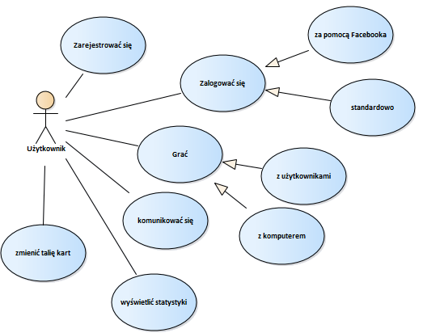

# Skat
go to application: https://skatinz.herokuapp.com/  
see game videos:
https://www.dropbox.com/sh/0ez947x35onq2k6/AAAViO8UPtCztLqVcU_6w5eha?dl=0

<h2>Application description</h2>
The main purpose of this application is to let people play Skat. In this program all micropayments have been eliminated to make it more playable. Skat is a web application, because the idea was to get to as many people as possible. User can log in via Facebook account and choose french-suited cards (an option dedicated especially to young players to make this application popular among them).

<h3>Technology</h3>
<h4>Server</h4>
<ul>
  <li>Node.js</li>
  <li>Socket.io</li>
  <li>Bcrypt.js</li>
  <li>Express</li>
  <li>Body-parser</li>
  <li>Express-session</li>
  <li>Mongoose</li>
  <li>Connect-mongodb-session</li>
  <li>Passport-facebook</li>
  <li>Passport-local</li>
  <li>Hbs</li>
 </ul>
<h4>Client</h4>
<ul>
  <li>Socket.io</li>
  <li>Bootstrap</li>
  <li>jQuery</li>
  <li>Animate.css</li>
</ul>

<h3>Functional requirement</h3>
<ul>
  <li>User must be able to register,</li>
  <li>User must be able to log in,</li>
  <li>User must be able to log in via Facebook account,</li>
  <li>User must be able to display his statistics (games played, games won, the highest declared value, games won divided into categories),</li>
  <li>User must be able to play with other users,</li>
  <li>User must be able to play with computer,</li>
  <li>User must be able to communicate with other users via chat,</li>
  <li>User must be able to choose deck suits (german and french available),</li>
  <li>System must have polish interface,</li>
  <li>System must have responsive interface,</li>
  <li>System must have web page as interface,</li>
  <li>System must react to the disconnection of the player during the game (appropriate information about further possible steps).</li>
</ul>

 

# Skat
przejdź do aplikacji: https://skatinz.herokuapp.com/  
lub zobacz filmiki z rozgrywki:
https://www.dropbox.com/sh/0ez947x35onq2k6/AAAViO8UPtCztLqVcU_6w5eha?dl=0

<h2>Opis aplikacji</h2>
Celem aplikacji internetowej jest umożliwienie gry w Skata. Program ma ułatwić rozgrywkę poprzez eliminację mikropłatności oraz interfejs w języku polskim. Aby dotrzeć do jak największej liczby graczy ma to być aplikacja internetowa. Realizacja celu pozyskania młodych graczy ma 
być zrealizowana poprzez umożliwienie logowania za pomocą konta na portalu społecznościowym Facebook oraz poprzez talię kart francuskich.

<h3>Technologia</h3>
<h4>Serwer</h4>
<ul>
  <li>Node.js</li>
  <li>Socket.io</li>
  <li>Bcrypt.js</li>
  <li>Express</li>
  <li>Body-parser</li>
  <li>Express-session</li>
  <li>Mongoose</li>
  <li>Connect-mongodb-session</li>
  <li>Passport-facebook</li>
  <li>Passport-local</li>
  <li>Hbs</li>
 </ul>
<h4>Klient</h4>
<ul>
  <li>Socket.io</li>
  <li>Bootstrap</li>
  <li>jQuery</li>
  <li>Animate.css</li>
</ul>

<h3>Wymagania funkcjonalne</h3>
<ul>
  <li>system musi umożliwić rejestrację nowych użytkowników,</li>
  <li>system musi umożliwić logowanie użytkowników,</li>
  <li>system musi umożliwić logowanie za pomocą konta utworzonego na portalu społecznościowym Facebook,</li>
  <li>system musi umożliwić wyświetlanie statystyk gracza (w tym liczbę rozegranych gier, liczbę wygranych gier, najwyższą zadeklarowaną wartość, liczbę wygranych gier w poszczególnych rodzajach gier),</li>
  <li>system musi umożliwić rozgrywkę z dostępnymi graczami,</li>
  <li>system musi umożliwić rozgrywkę z komputerem,</li>
  <li>system musi umożliwić komunikację pomiędzy użytkownikami w formie czatu,</li>
  <li>system musi umożliwić wybór talii kart (dostępne dwie talie francuska oraz niemiecka),</li>
  <li>interfejs systemu musi być w języku polskim,</li>
  <li>interfejs musi być responsywny,</li>
  <li>interfejsem musi być strona www,</li>
  <li>system musi reagować na rozłączenie gracza w czasie rozgrywki (odpowiednia informacja o dalszych możliwych krokach).</li>
</ul>

